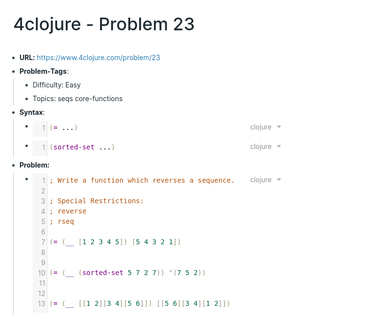

# Summary

Download the vanilla.json in the out-folder and import it into your Roam-graph to get a page with a list of all the 4clojure problems and one page per problem that includes the URL, description, syntax and code of that problem (the import adds 145 pages!).

# What:

This repo includes scripts for scraping the programming-problems from 4clojure and transforming them into a tree-structure Roam-ready JSON file.

It also includes variants of a ready-made JSON-file that you can import into your RoamResearch graph.

# How:

By importing this specially formatted file int your RoamResearc you can:

- track your progress on each problem in Roam
- take notes for each problem in Roam
- use Roam-plugins like [roamsr](https://github.com/aidam38/roamsr) to learn the problems with Spaced Repetitions

There is one variant in the out-folder:

- vanila.json (145 pages): includes one page that lists all the 4clojure problems and one page per problem that contains all the contents (tags, description, constraints, syntax, code).

You can import the variant with the Import-menu in RoamResearch. First you need to download the json by going to the "out"-folder, clicking on the json file and then right-click on "RAW" and "Save as".

## Example:

Example for the Problem 23-page:

The syntax-block only includes syntax that is not already included in a lower problem.

# Plans:

Future variants are planned:

- roamy: includes the vanilla-variant, tags for each problem, tags for solved-problems, a query for displaying solved and unsolved problems, a todo-list of used syntax for each problems to make sure you understand the code before trying to solve it (each syntax element only appears once and is not repeated in other problems!).
- roamysr: includes roamy-variant, adds a #sr tag to each problem and a question for each piece of syntax. (WARNING: this adds about 200 prompts to your roamsr-queue so dont do it if you dont have the time for pure Clojure-learning)

# License:

- Custom code is MIT licensed (see LICENSE file).
- The 4clojure problems are EPL v. 1.0 licensed (see LICENSE-4clojure file and [4clojure](https://www.4clojure.com/))
